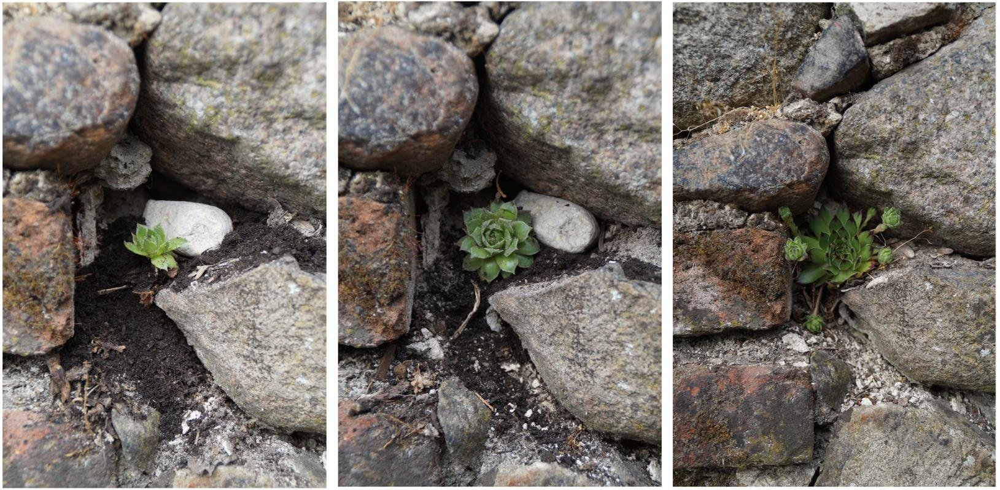
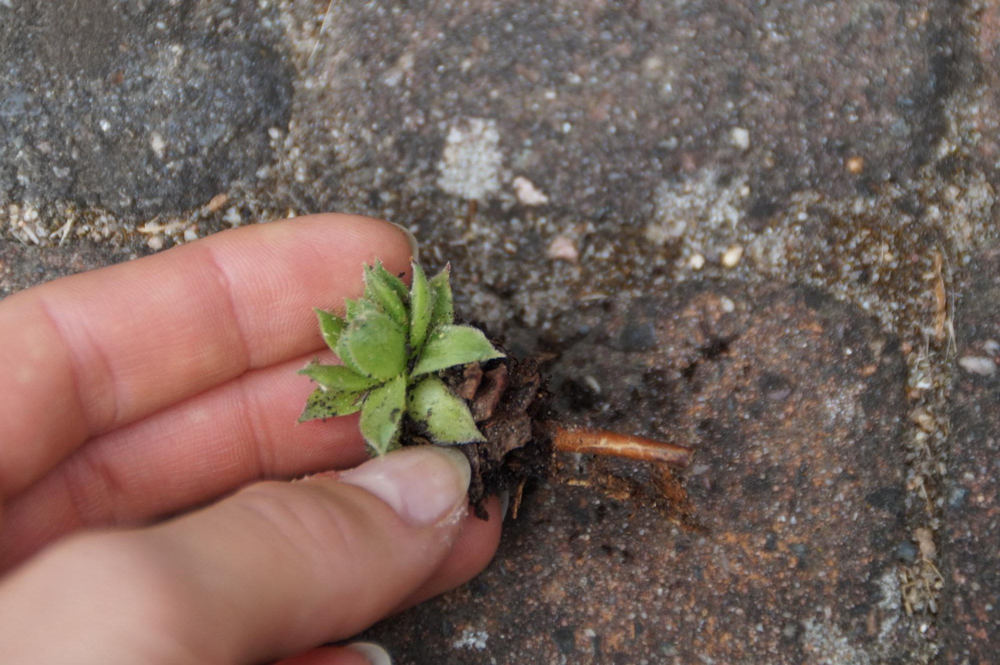
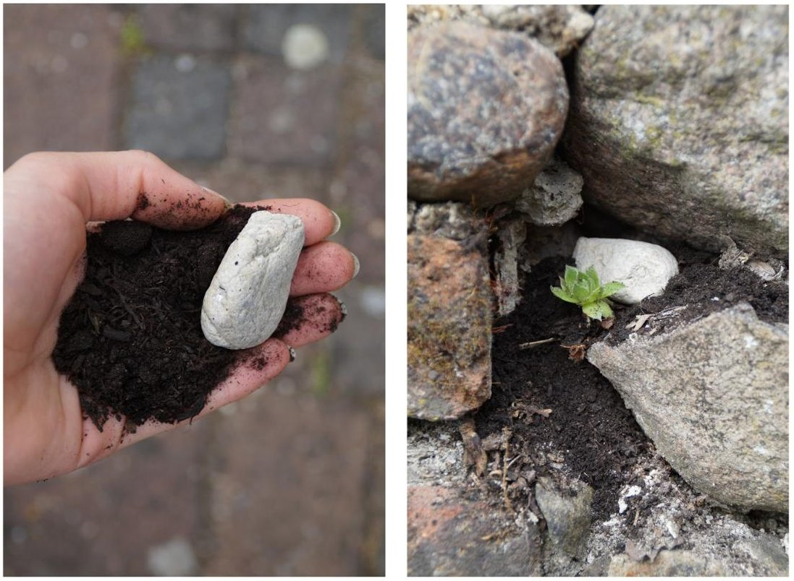
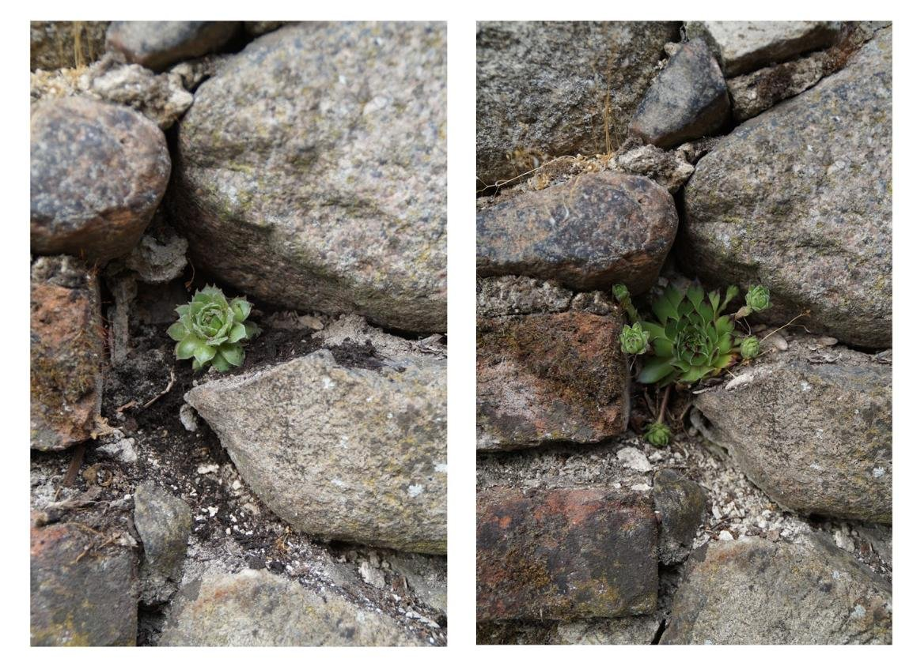
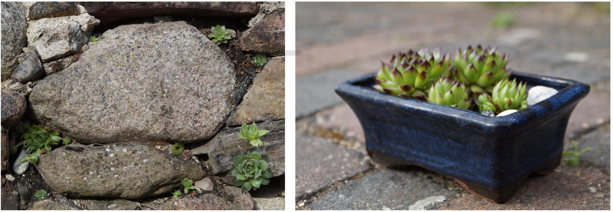

Versiegelungen zu Begrünen ist ein wichtiges Tool zur Erhaltung der Vielfalt, Luftqualität und Wasserspeicherkapazität in urbanen aber auch ländlichen Raum. Hierfür eignen sich nicht nur dächer und Fassaden auch mauern lassen sich mit etwas Geduld sehr gut selber von Hand ohnen großen Aufwand oder Kosten begrünen. Das Experiment 3. zeigt in einer kurzen Schritt für Schritt Anleitung wie man eine Feldsteinmauer ganz einfach mit Steingartenpflanzen Begrünen kann.
In diesem Experiment handelt es sich um die sogenannte Hauswurz, die sehr unempfindlich auf Trockenheit und Wassermangel reagiert und daher perfekt geeignet ist.

## Schritt 1.: Das Trennen von der Mutterpflanze

Hierfür einfach einen kleinen Ableger von der Mutterpflanze abtrennen. Hauswurz ist in jedem herkömmlichen Baumarkt oder Pflanzenmarkt erhältlich. Oder frage nach einem Hauswurz Ableger in unserer [Pflanzrausch Sharing Gruppe](https://t.me/pflanzrausch). Sie verbreitet sich bei guten Bedingungen sehr schnell.

## Schritt 2.: Ab an die Mauer

Schnappe dir etwas frische Pflanzerde und einen etwa Daumen großen Stein. Lege die Erde in eine geeignete Nische der Mauer und drücke deine kleine Hauswurz gut fest. Den Sein legst du auf die Erde zur Befestigung der Wurzel. Er hilft das deine Hauswurz nicht beim nächsten Regen weggespült wird. Nach ein Paar Wochen, wenn deine Pflanze angewurzelt hat, kannst du ihn entfernen.

## Schritt 3.: Jetzt heißt es nur noch abwarten

Bei großer Trockenheit kannst du deine Hauswurz gelegentlich gießen. Den Rest schafft sie ganz allein. Nach etwa 8 Wochen sollte sie die Größe des rechten Bildes erreicht haben. Es bilden sich wieder neue Ableger und du kannst wieder bei Schritt 1. starten!

Übrigens: Hauswurze machen sich auch prima in einer Pflanzschale auf dem Fensterbrett!
