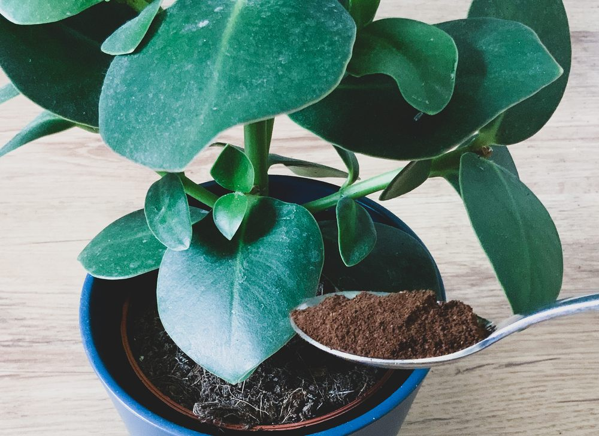
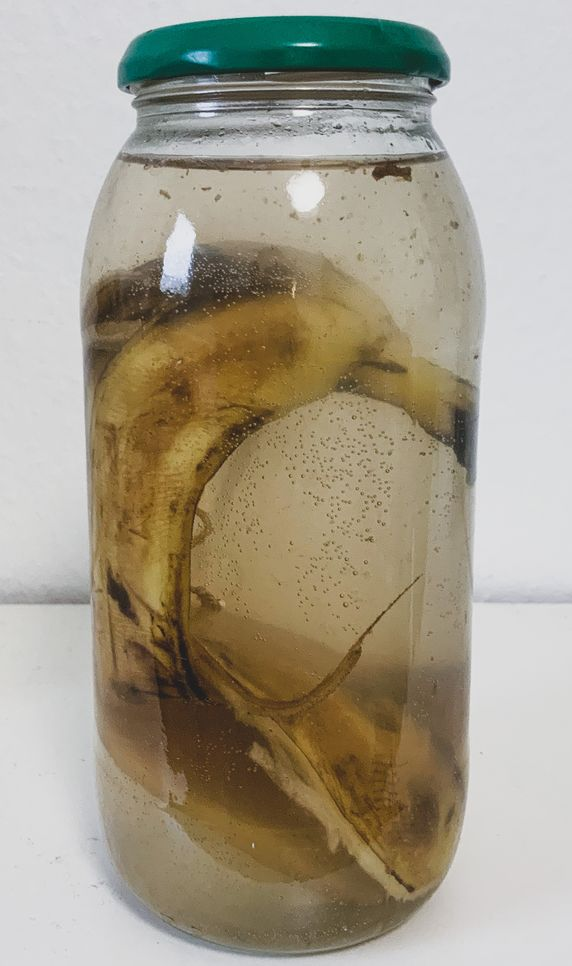

## Gemahlener Kaffee
Man kann ihn nicht oft genug auflisten, den guten alten Kaffeesatz. Da er reich an und Stickstoff ist verändert er den Ph-Wert des Bodens in leicht sauer. Dies kommt vielen Pflanzen sehr gelegen. Bevor du den Kaffeesatz jedoch zu denen Lieblingen streust solltest du ihn gut austrocknen lassen, da er sonst anfangen könnte zu schimmeln und das wiederrum schlecht für deine Pflanzen wäre. Besitzt du einen Garten kann der Kaffeesatz sogar Regenwürmer anlocken und Schädlinge wie Schnecken oder Ameisen an deine Pflanze vertreiben.

## Bananenschalen- Eine Wunderwaffe
>*Bananenschalen enthalten eine Reihe von Nährstoffen, wie Kalium Magnesium, Calcium und ein wenig Stickstoff und Schwefel. Ein wahres Pflanzenfestmahl.*

1. **Bananenschalen pur**\
Eine Möglichkeit Bananenschalen zu verwenden ist sie direkt unter die Erde zu heben. Schneide sie dabei in kleinere Stücke damit sie sich besser zersetzt.
2. **Flüssigdünger**\
Sie können ihre Pflanzen auch mit einem selbstgemachten Flüssigdünger bereichern. Dazu geben sie entweder eine zerstückelte Bananenschale in 1 Liter Wasser und bringen es zum kochen. Danach lassen sie es über Nacht ziehen und entfernen die Bananenreste aus dem Sud. Dann nur noch im Verhältnis 1:5 mit Wasser verdünnen. Des Weiteren können sie die Bananenschale in ein Glas geben und mit Wasser auffüllen, verschließen und zwei Tage ziehen lassen. Hier kannst du auch verdünnen, wenn du möchtest.
3. **Blattpflege mit Bananenschalen**\
Besonders in staubigen Wohnungen leiden Pfl anzen meist, weil es sich auf ihren Blättern absetzt und sie dadurch nicht mehr so viel Sonnenlicht abbekommen. Bananenschalen eignen sich hervorragend dafür genau diesen Staub zu entfernen. Reiben sie einfach mit der Innenseite der Bananenschale über die Blätter. Der Staub haftet sehr gut an der klebrigen Innenseite und sie bringen ihre Blätter zum glänzen.

## Das Frühstücksei
Während der Inhalt des Eies deinen Gaumen erfreut, kannst du mit der Schale deinen Zimmerpflanzen etwas gutes tun. Eierschalen sind reich an Calcium und Kalk und damit perfekt geeignet zur nachhaltigen Pfl anzendüngung. Damit die optimale Dosis an deine Pflanze kommt, solltest du die Eierschalen von der dünnen inneren Haut befreien und anschließend zermahlen. Das zermahlene Eierschalen-Gut kannst du nun in Wasser auflösen und zur besseren Wirkung etwas ziehen lassen. Anschließend einfach deine Pflanzen damit gießen.

## Die Fingernägel?
Der Gedanke ist merkwürdig und vielleicht auch etwas eklig, doch es ist nicht zu verleugnen das Fingernägel der perfekte nachhaltige Dünger sind. Fingernägel enthalten viel Stickstoff und können damit als Dünger durchaus dienen. Dafür einfach bei der nächsten Maniküre ein paar Fingernägel aufheben und in der Erde deines Zimmerpflanzen oder Balkontopfes vergraben.

## Die Asche
Es ist kein Geheimnis, dass Asche die optimale Grundlage zur Entstehung neuen Lebens und zur Ansiedlung von Keimlingen ist. Auch als Dünger macht sich Asche hervorragend. Deine Pflanze wird sich nach deiner Aschen Kuhr wie neugeboren fühlen. Dafür einfach etwas Asche aus deinem Kamin oder beim nächsten Lagerfeuer mitnehmen, und natürlich abgekühlt auf die Erde deiner Pflanze streuen. Natürlich solltest du das nur machen, wenn naturbelassenes Holz verbrannt wurde und keine Lacke oder Kunststoffe!