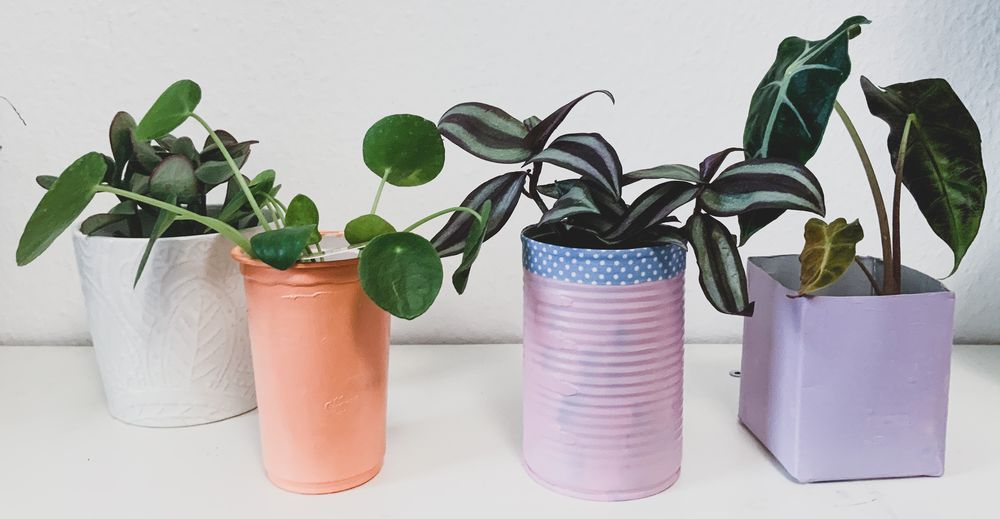
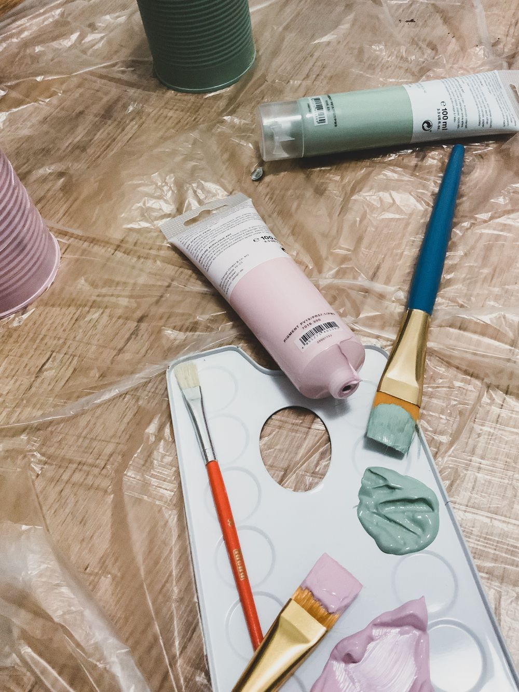
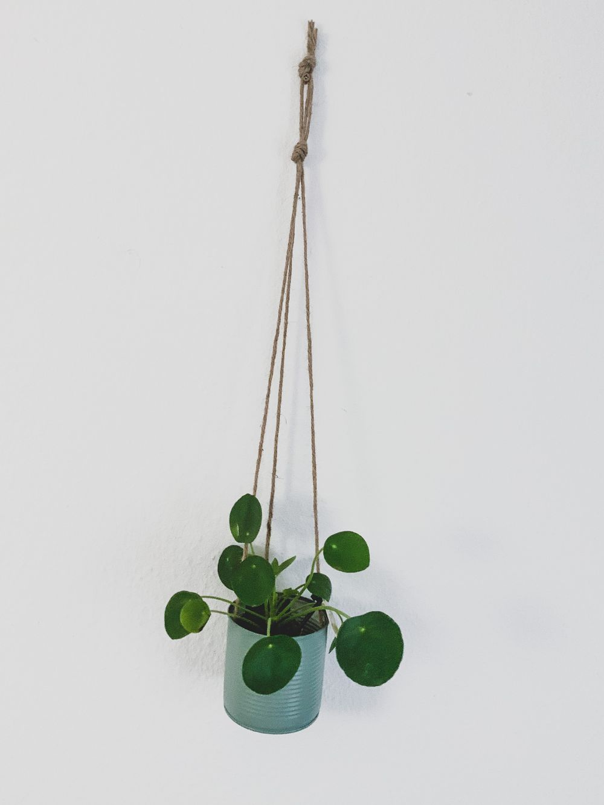
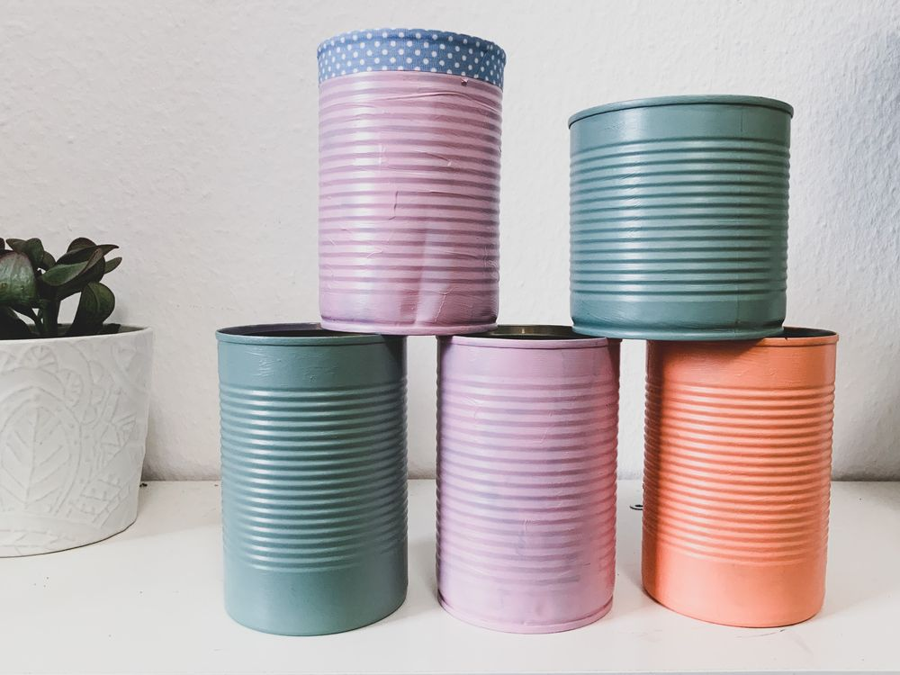

Mit diesen DIY-Anleitungen für Pflanzengefäße wird jeder neidisch! Vor allem brauchst du dafür nichts besonderes kaufen, das meiste davon landet sonst im Müll.

### Was du brauchst:
- Konservendosen oder anderen „Müll“
- Evtl. Schnur
- Evtl. Bohrmaschine
- Farben zum bemalen der Dosen z.b Acrrylfarbe

### Wie gehst du vor?
Die meisten von uns haben Konservendosen oder auch anderen Verpackungsmüll bereits Zuhause. Anstatt sie wegzuwerfen, mache lieber etwas schönes daraus.

## Pflanztöpfe basteln
Damit du etwas nachhaltiges und umweltbewuss-
tes machen kannst für dich und vielleicht auch
für Pflanzrausch, kannst du ja mal versuchen
aus Verpackungsmüll eigene Töpfe herzustellen.

1. **Dose reinigen**\
Als ersten Schritt ist es wichtig deine Dosen richtig zu reinigen und von potentiellen Keimherden zu befreien. Du kannst dabei auch schon das Etikett und den Etikettenkleber entfernen.
2. **Dose gestalten**\
Hole dir Farben, falls nicht bereits vorhanden und male die Konserven mit den ausgewählten Farben an. Manchmal braucht man zwei Anstriche damit die Farbe gut hält. Das können unter anderem Kreidefarbe, Acrylfarbe oder Sprayfarbe sein.

3. **An der Wand oder Decke befestigen**\
Fädle die Schnüre, die am besten zwischen 60-70 cm
betragen von außen nach innen. Verknote diese oder kle-
be sie mit sehr starkem Tape fest. Verknote dann oben alle
Schnüre, sodass noch genügend Schnur übrig bleibt
um einen weiteren Knoten über diesen zu machen
aus all den Schnüren um quasi eine Lasche herzustellen
für die Befestigung.

4. **Bohre Löcher in die Unterseite**\
Wenn du deine Pflanzen in Erde einsetzt ist es ratsam Löcher in den Boden zu bohren, damit sich keine Staunässe bildet und deine Wurzeln anfangen zu Schimmeln bzw. zu faulen. Bei Hydrokulturen ist das nicht nötig.

>>Wiederhole das Upcycling mit anderem Verpackungsmüll! Lasse deiner Kreativität freien lauf. Wie wäre es zum Beispiel, wenn du Perlen an den Schnüren befestigst oder Muster auf die Konserve malst. Deiner Kreativität sind keine Grenzen gesetzt. Das Projekt lässt sich nur nebenbei auch gut mit Kindern umsetzen.

