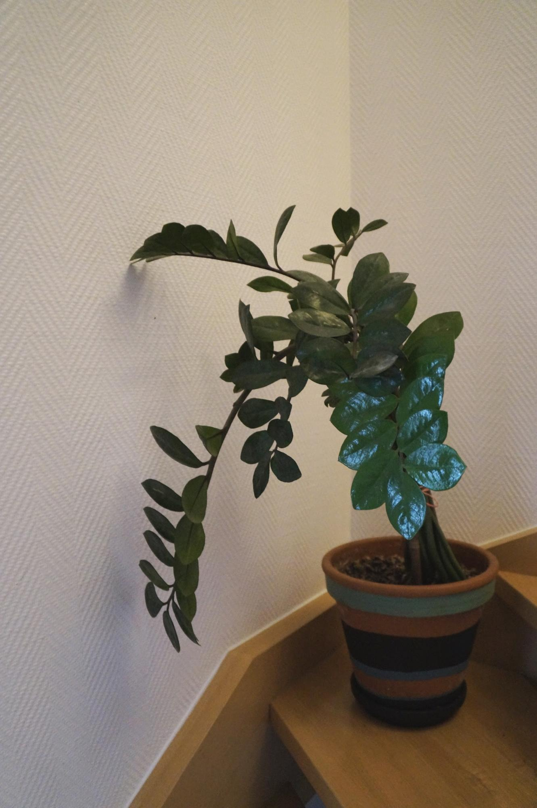
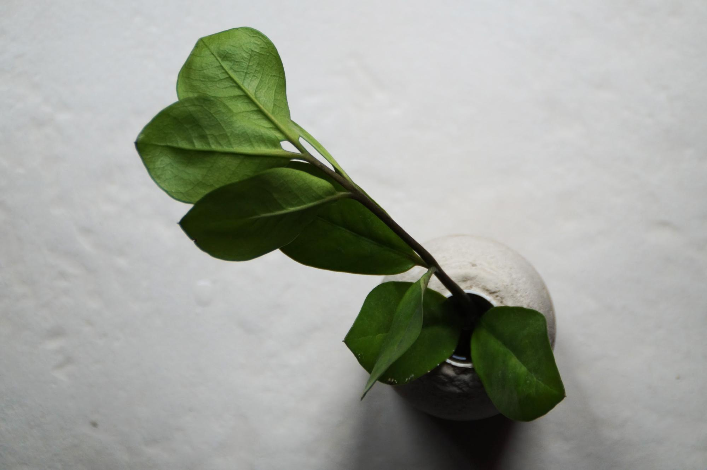
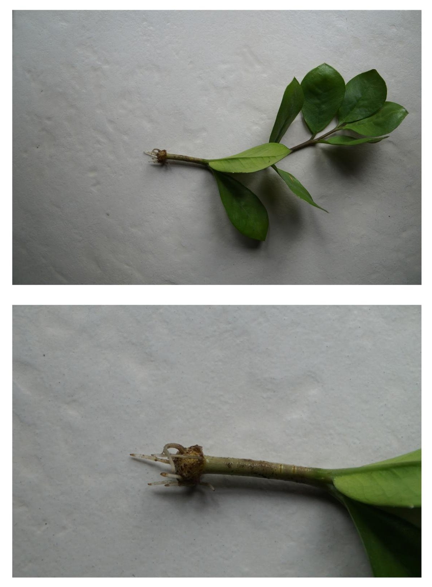
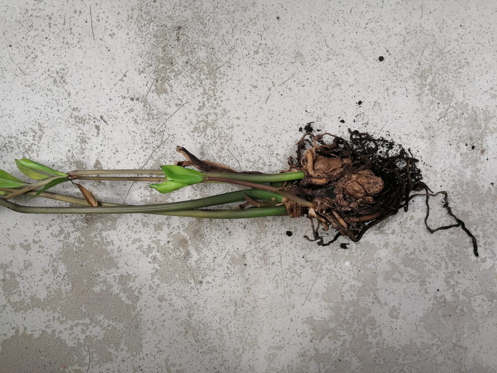
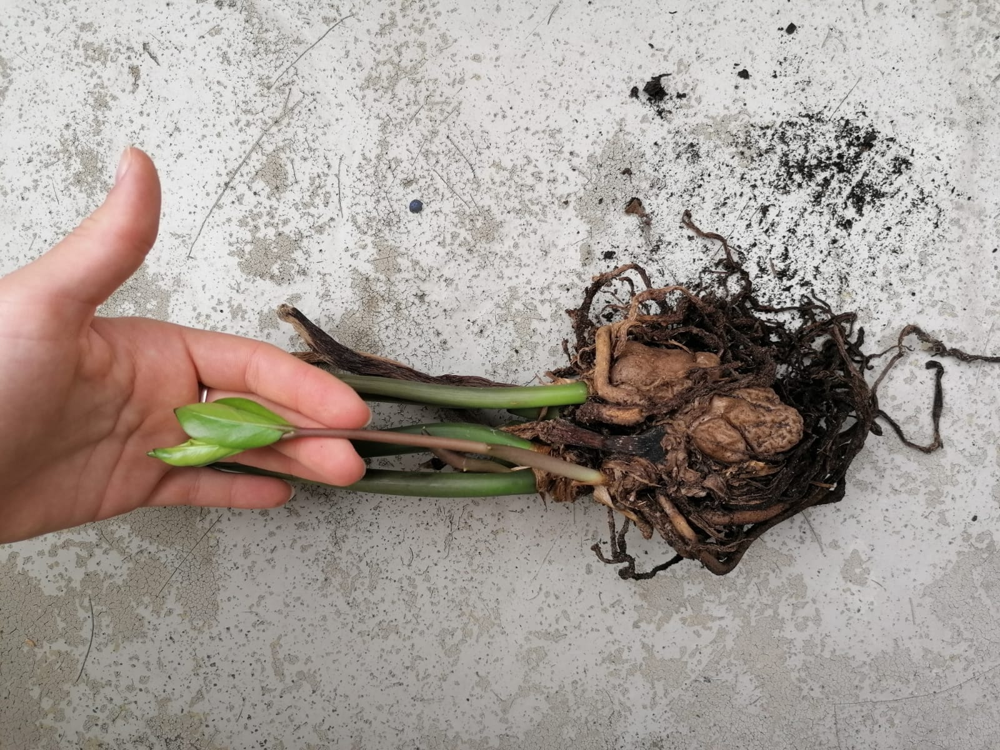

Die meisten Pflanzen, vor allem Zimmerpflanzen, kann man über Triebe vermehren.
Anhand der Zamie erklären wir dir die Schritte, wie auch du deine Pflanzen vermehren kannst.

Die Zamie (Zamioculcas zamiifolia) ist die Zimmerpflanze für jedermann. Sie ist genügsam und sehr haltungs freundlich selbst für ahnungslose Erstbesitzer. Zu dem lässt sich die Zamie kinderleicht vermehren und ist damit der perfekte Kandidat für Plant Sharing! Wie das ganz einfach klappt erfährst du nachfolgend.

## Schritt 1.: Ran an die Mutterpflanze!

Um eine neue kleine Zamie zu ziehen brauchst du zunächst eine Mutterpflanze oder du fragst in der [Pflanzrausch Sharing Gruppe](https://t.me/pflanzrausch) nach einem Ableger. Ist dieser groß genug geworden und hat mindestens drei Triebe gebildet, kannst du loslegen. 
Schneide einen Trieb oder ein Stück eines Triebes (von Größe der Mutterpflanze abhängig) mit einer sauberen Schere glatt von der Mutterpflanze ab.

## Schritt 2.: Warten im Wasser

Nun stellst du den Trieb in eine Vase mit frischem Wasser. Jetzt heißt es warten. Gelegentlich kannst du das Wasser für deine neue Zamie erneuern.

## Schritt 3.: Es wurzelt!

Schon nach 3-4 Wochen kannst du erste Erfolge sehen. Die Zamie hat am Ende des Triebes einen kleinen Ballen gebildet und wurzelt langsam aus.

## Schritt 4.: Nach einiger Zeit

Die Zamie bildet ein dickes, dichtes Wurzelwerk, spätestens jetzt ist sie bereit zum einpflanzen! Und du kannst sogar schon wieder mit einem neuen Ableger beginnen.

